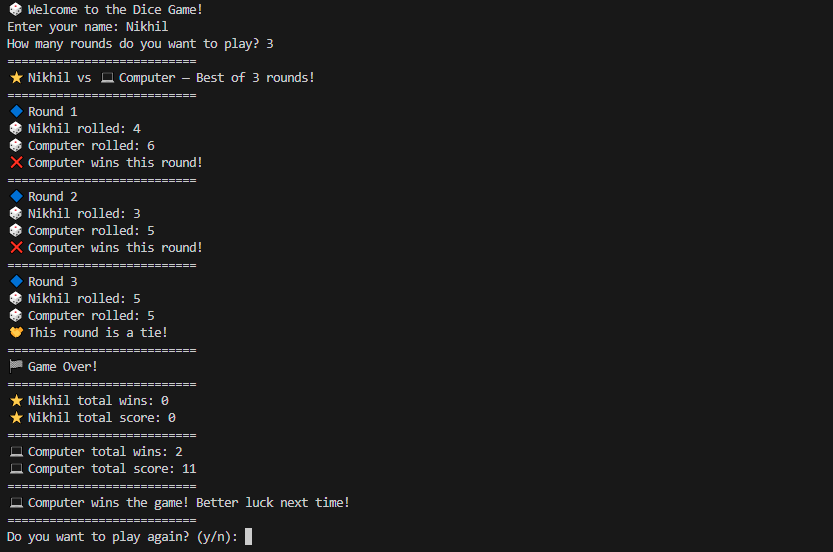

# 🎲 DiceGame — Python CLI

> A simple, fun, and beginner-friendly **command-line dice game** written in Python.  
> Roll the dice against the computer — may the odds be in your favor!

[](https://www.python.org/)  

---

## 📸 Demo



---

## ✨ Features

✅ Command-line interface (CLI)  
✅ Best-of-N rounds — configurable  
✅ Tracks wins, losses, and draws  
✅ Play again option after each game  
✅ Beginner-friendly and well-commented Python code

---

## 🚀 Getting Started

### 🧰 Requirements

- Python 3.x

### ▶️ Run the game

Clone the repo and run the script:

```bash
git clone https://github.com/Nikhil-Kumar-Shah/DiceGame_Python_CLI.git
cd DiceGame_Python_CLI
python DiceGame_Python_CLI.py
```

---

## 📂 Project Structure
```
📂 DiceGame_Python_CLI
├── DiceGame_Python_CLI.py           # Main game script
├── DiceGame_Python_CLI.png          # Screenshot/demo image
├── README.md                        # Project documentation
```

# Author

## **Nikhil Kumar Shah**  
📧 [Email](mailto:nikhil102007@gmail.com) &nbsp; 🌐 [Portfolio](https://nikhil-kumar-shah.github.io/portfolio/) &nbsp; 💻 [GitHub](https://github.com/Nikhil-Kumar-Shah) &nbsp; 🔗 [LinkedIn](https://linkedin.com/in/nikhilkumarshah)

